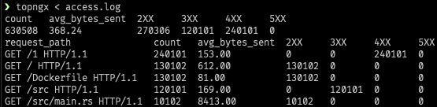

# topngx
[](https://github.com/gsquire/topngx/actions)

This tool is a rewrite of [ngxtop](https://github.com/lebinh/ngxtop) to make it easier to install
and hopefully run faster. For those unfamiliar with the ngxtop, it is a tool that helps you
parse NGINX access logs and print various statistics from them regardless of format. It is
currently not as feature complete as the original version but it should have enough functionality
to be usable.



## Installation
There are a few ways to install it. The easiest way is to grab a release from [here](https://github.com/gsquire/topngx/releases).
Otherwise, you can install it from [crates.io](https://crates.io/crates/topngx) with a working Rust
installation:

```sh
cargo install topngx

# If you do not have SQLite headers installed on your system, you can use the bundled feature.
cargo install topngx --features bundled-sqlite
```

SQLite development headers are easy to get on Mac and Linux:

```sh
# On Mac.
brew install sqlite

# On Debian based Linux.
sudo apt-get update && sudo apt-get install libsqlite3-dev
```

## Usage
```sh
topngx 0.1.0
Garrett Squire <github@garrettsquire.com>
top for NGINX

USAGE:
    topngx [FLAGS] [OPTIONS] [SUBCOMMAND]

FLAGS:
    -h, --help         Prints help information
    -n, --no-follow    Do not tail the log file and only report what is currently there
    -V, --version      Prints version information

OPTIONS:
    -a, --access-log <access-log>    The access log to parse
    -f, --format <format>            The specific log format with which to parse [default: combined]
    -g, --group-by <group-by>        Group by this variable [default: request_path]
    -w, --having <having>            Having clause [default: 1]
    -t, --interval <interval>        Refresh the statistics using this interval which is given in seconds [default: 2]
    -l, --limit <limit>              The number of records to limit for each query [default: 10]
    -o, --order-by <order-by>        Order of output for the default queries [default: count]

SUBCOMMANDS:
    avg      Print the average of the given fields
    help     Prints this message or the help of the given subcommand(s)
    info     List the available fields as well as the access log and format being used
    print    Print out the supplied fields with the given limit
    query    Supply a custom query
    sum      Compute the sum of the given fields
    top      Find the top values for the given fields
```

Some example queries are:

```sh
# Run with the default queries and format (combined).
# Or use the --access-log and --no-follow flags if you do not want to read from standard input.
topngx < /path/to/access.log

# Output:
count  avg_bytes_sent  2XX  3XX  4XX  5XX
2      346.5           2    0    0    0
request_path              count  avg_bytes_sent  2XX  3XX  4XX  5XX
GET / HTTP/1.1            1      612             1    0    0    0
GET /some_file1 HTTP/1.1  1      81              1    0    0    0

# See the fields that you can use for queries.
topngx info < access.log

# Use a custom log format.
topngx -f '$remote_addr - $remote_user [$time_local] "$request" $status $bytes_sent' info

# Output:
access log file: STDIN
access log format: $remote_addr - $remote_user [$time_local] "$request" $status $bytes_sent
available variables to query: remote_addr, remote_user, time_local, request_path, status_type, bytes_sent

# Run a custom query.
# The fields passed in can be viewed via the info sub command.
topngx query -q 'select * from log where bytes_sent > 100' -f request_path bytes_sent < access.log
```

## Limitations
There is no option to filter the data but this could be added in the future. The original version
allowed for automatic detection of NGINX configuration files, log file paths, and log format styles.
topngx currently has command line options for these and may add this functionality in a later version.

If you find any other issues or features that may be missing, feel free to open an issue. You can
also utilize logging via the [env_logger](https://github.com/sebasmagri/env_logger/) crate.

```sh
# See the env_logger README for the various levels.
RUST_LOG=debug topngx < /path/to/access.log
```

## License
MIT

The ngxtop license can be seen [here](https://github.com/lebinh/ngxtop/blob/master/LICENSE.txt).
